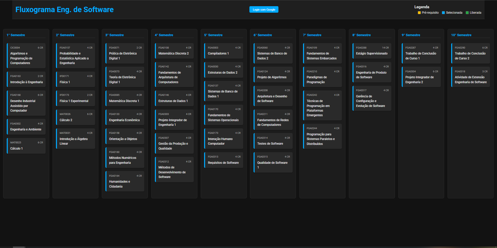

# Fluxograma Interativo de Cursos - UnB

Um projeto criado para oferecer uma visualização clara e interativa da grade curricular do curso de Engenharia de Software da Universidade de Brasília (UnB), com funcionalidades para acompanhamento pessoal do progresso acadêmico.

A ideia surgiu após uma instabilidade no sistema da universidade, motivando a criação de uma ferramenta alternativa, moderna e funcional.

**[Acesse a versão ao vivo aqui!](https://afrontoso.github.io/FluxogramaCurso/)**

 

---

## ✨ Funcionalidades

* **Visualização Interativa:** Navegue pela grade curricular completa, com as matérias organizadas por semestre.
* **Pré-requisitos Visuais:** Clique em uma matéria para ver quais são seus pré-requisitos e quais matérias ela libera, com linhas conectando os cards.
* **Login com Google:** Autentique-se com sua conta Google para salvar seu progresso de forma segura.
* **Acompanhamento de Progresso:** Marque as matérias que você já concluiu. Suas escolhas ficam salvas na sua conta.
* **Painel de Progresso:** Tenha uma visão geral do seu avanço no curso, com a contagem de créditos e horas totais, concluídas e restantes.
* **Adição de Matérias Customizadas:** Adicione matérias optativas ou de extensão diretamente no seu fluxograma.
* **Persistência de Dados:** Todos os seus dados (matérias concluídas e customizadas) são salvos na nuvem com o Firebase Firestore.

---

## 🚀 Tecnologias Utilizadas

* **Frontend:** HTML5, CSS3 e JavaScript "puro" (Vanilla JS).
* **Autenticação e Banco de Dados:** Google Firebase (Authentication e Firestore).
* **Visualização de Linhas:** Biblioteca `leader-line-new`.

---

## 🔮 Planos Futuros

O objetivo é expandir este projeto para que ele se torne uma ferramenta para **todos os cursos da UnB**. Os próximos passos incluem:

-   [ ] Refatorar o projeto para **React** para melhor escalabilidade e componentização.
-   [ ] Criar um sistema para carregar diferentes grades curriculares (JSON, API, etc.).
-   [ ] Adicionar um menu de seleção de cursos.
-   [ ] Melhorar a interface e a experiência do usuário.

---

## Licença

Este projeto está sob a licença MIT. Veja o arquivo [LICENSE](LICENSE) para mais detalhes.